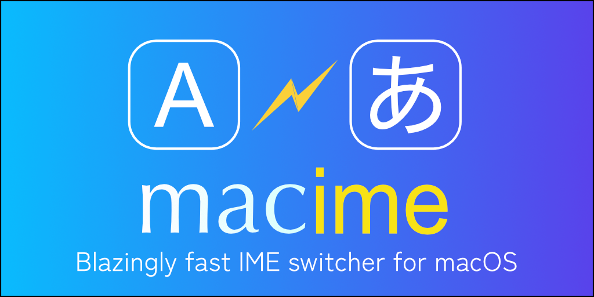

<p align="center">
  
</p>

<h1 align="center">macime</h1>

<p align="center">
A <strong>Blazingly fast</strong> IME switching tool for macOS,</br>
built with Swift and powered by launchd,</br>
delivering near-native IME switching speed.
</p>

<p align="center">
  
  
  
  
  
</p>


## 📖 Story

I've used [macism](https://github.com/laishulu/macism) and [im-select](https://github.com/daipeihust/im-select) before.  
But on my older Macs, these tools always required `a short wait` to switch IME modes. It was an unacceptable delay for daily use. (approximately 400ms)

This tool reduces the delay by about **95%** when running as a daemon or launchd — down to 5–20 ms (around **20× faster** than other tools), delivering near-native IME switching.

(I was already very satisfied with the switching speed since `v3.x`, but `v4.x` broke through that limit.)

If you’re a Mac user frustrated by slow IME switching, give it a try. 


## ⚡ Why it’s fast

1. Sets and gets the IME in a single operation
2. Works as a daemon or launchd(brew service)
3. The daemon handles IME switching internally
4. Written in native Swift
5. Optimized code


## ✨️ Features

* Standalone (`macime`):
    * Get, Set, Save current, Load previous, List all IMEs
    * Switch IME while saving the previous one (in single step)
    * Output detailed get|list results as JSON
* Daemon/launchd (`macimed`):
    * Blazingly fast switching via daemon or `brew services`
* Compatibility:
    * Fallback to `im-select` style command usage
* Others:
    * Stable switching for CJK input methods (Experimental)


## ⚠️ Breaking Changes

* [v4.4.0](https://github.com/riodelphino/macime/releases/tag/v4.4.0):
    * Add pre-compiled binaries (`macime`, `macimed`) - no `xcode` or build required.
* [v4.0.0](https://github.com/riodelphino/macime/releases/tag/v4.0.0):
    * Switching speed is extremelly accelarated via internal `IME.swift` calling.
* [v3.6.0](https://github.com/riodelphino/macime/releases/tag/v3.6.0):
    * Deprecate `--status` `--sock-path` `--macime-path` options from `macimed` (They don't reflect environmental variable)
    * Deprecate `--launchd` option from `macime` (Doesn't work in some cases)
    * Allow `macimed` socket command to handle both `ime` and `daemon` methods (e.g. `ime set com.apple...`, `daemon get sock-path`)
    * Upgrade macOS version (10.13 -> 10.15)
* [v3.5.0](https://github.com/riodelphino/macime/releases/tag/v3.5.0): Add CJK refreshing (Experimental)
* [v3.4.0](https://github.com/riodelphino/macime/releases/tag/v3.4.0): Revive `$MACIME_TEMP_DIR` env and Add `$MACIME_SOCK_PATH`
* [v3.3.3](https://github.com/riodelphino/macime/releases/tag/v3.3.3): Deprecate `--json` option (Use `--detail` option instead)
* [v3.0.0](https://github.com/riodelphino/macime/releases/tag/v3.0.0): Deprecate `$MACIME_TEMP_DIR` environmental value


## 📦 Requirements

* macOS (>=10.15)
* `com.apple.keylayout.ABC` is installed and enabled (macOS's default. Used in `load` sub-command)

## 🛠 Install

### 🍺 Homebrew

```bash
brew tap riodelphino/tap
brew install macime
```

### ⚙️ Manual

Select specific version and CPU architecture from:
[https://github.com/riodelphino/macime/releases](https://github.com/riodelphino/macime/releases)

for Intel Mac:
```bash
curl -L -O https://github.com/riodelphino/macime/releases/download/v4.4.0/macime-v4.4.0-x86_64.tar.gz
tar -zxvf macime-v4.4.0-x86_64.tar.gz
mv macime macimed ~/bin
```
for Apple Silicon:
```bash
curl -L -O https://github.com/riodelphino/macime/releases/download/v4.4.0/macime-v4.4.0-arm64.tar.gz
tar -zxvf macime-v4.4.0-arm64.tar.gz
mv macime macimed ~/bin
```
Then add environmental variable to your `~/.zshrc` or `~/.bashrc` or `~/.profile`:
```bash
export MACIME_PATH="$HOME/bin/macime"
```

* Replace `v4.4.0` to your desired version tag.
* Replace `~/bin` and `$HOME/bin/macime` to your desired directory.
* Execute permission has already been granted.


## 🗑️ Uninstall

### 🍺 Homebrew

```bash
brew uninstall macime
```

### ⚙️ Manual

- Remove installed binaries.
- Remove the `MACIME_PATH` environmental variable.


## ⬆️ Upgrade

### 🍺 Homebrew

```bash
brew update
brew upgrade macime
```
If launchd service is enabled, ensure to restart it:
```bash
brew services restart macime
```

### ⚙️ Manual

Just overwrite the binaries.


## 📘 Usage

### ⚡ macime

Show `macime` version:
```bash
macime --version
macime -v
```

Show `macime` help:
```bash
macime --help
macime -h
```

Sub commands:
```bash
macime get [options]
macime set <IME_ID> [options]
macime list [options]
macime save [options]
macime load [options]
```

`get`
Show the current IME.

`set`
Switch to the specified IME.
Optionally saves the previous IME.

`list`
List available IMEs.

`save`
Save current IME.

`load`
Restore the previous IME.


#### ⚙️ Fallback behavior (im-select compatible)

`macime` supports im-select–style shortcuts.

```bash
# Falls back to `macime get`
macime

# Falls back to `macime set`
macime com.apple.keylayout.ABC
```

#### 🔎 Get current IME
```bash
# Get current IME ID
macime get
# com.apple.keylayout.ABC

# Get current IME detailed info as JSON
macime get --detail
# {
#   "isSelectCapable" : true,
#   "isSelected" : true,
#   "localizedName" : "ABC",
#   "id" : "com.apple.keylayout.ABC",
#   "sourceLanguages" : [
#     "en",
#     ...
#     "zu"
#   ]
# }
```

#### 🎯 Set IME
```bash
# Set IME
macime set com.apple.keylayout.ABC

# Set IME while saving current IME as `GLOBAL`
macime set com.apple.keylayout.ABC --save
# The IME ID is saved at `/tmp/riodelphino.macime/prev/GLOBAL`

# Set IME while saving current IME as <session_id>
macime set com.apple.keylayout.ABC --save --session-id nvim-1001
# The IME ID is saved at `/tmp/riodelphino.macime/prev/nvim-1001`
```

`--cjk-refresh` option is also available.

> [!Note]
> Using `set` with `--save` reduces execution time by **50%**, compared to running `get` and `set` separately.
> Other tools require two excutions. (e.g. `im-select` -> `im-select set com.apple.keylayout.ABC`)


#### 💾 Save IME
```bash
# Save current IME to `GLOBAL`
macime save
# Current IME ID is set to `/tmp/riodelphino.macime/prev/GLOBAL`

# Save current IME to `<session_id>`
macime save --session-id nvim-1001
# Current IME ID is set to `/tmp/riodelphino.macime/prev/nvim-1001`
```

#### ♻️ Load IME
```bash
# Load IME from `GLOBAL`
macime load
# Reads previous IME ID from `/tmp/riodelphino.macime/prev/GLOBAL`, then set it.

# Load IME from `<session_id>`
macime load --session-id nvim-1001
# Reads previous IME ID from `/tmp/riodelphino.macime/prev/nvim-1001`, then set it.
```

`--cjk-refresh` option is also available.


#### 📋 List IME
```bash
# Show IME ID list
macime list

# Show IME detailed list as JSON
macime list --detail

# Show only selectable IME
macime list --select-capable
```
> [!Note]
> `--detail` and `--select-capable` can be mixtured

#### ⚙️ Options

| Option                    | Available for | Description                                                                              |
| ------------------------- | ------------- | ---------------------------------------------------------------------------------------- |
| --detail                  | get, list     | Show detailed IME info as JSON                                                           |
| --select-capable          | get, list     | Show only selectable IME                                                                 |
| --save                    | set           | Save current IME (with `macime set` only)                                                |
| --session-id <string> | save, load    | Specify the save / load session id (= filename in temp dir)                              |
| --cjk-refresh             | set, load     | Refresh IME for CJK input methods (Experimental)                                         |
| --cjk-delay <number>      | set, load     | Set CJK refreshing delay time as a number between 0 and 1 (Default: 0.05) (Experimental) |
| --debug                   | (all)         | Show debug information                                                                   |

#### ⚙️ CJK refreshing

> [!Warning]
> Experimental.
> Please test in your environment, then report any issues or submit a PR.

Reduces the failure rate of CJK IME switching, by creating a hidden window and forcibly refreshing the IME.  
It still fails sometimes (Not perfect).

e.g.
- `Google日本語入力`: Google Japanese Input
- `百度拼音`: Baidu Pinyin
- `搜狗拼音`: Sogou Pinyin

via `--cjk-refresh` and `--cjk-delay` option:
```bash
# Set
macime set com.baidu.inputmethod.BaiduPinyin --cjk-refresh --cjk-delay 0.05
macime set com.sogou.inputmethod.sogou --cjk-refresh --cjk-delay 0.05

# load
macime load --cjk-refresh --cjk-delay 0.05
```

### ⚡ macimed

`macimed` is a daemon bundled with `macime`. It enables blazing faster IME switching.  
It runs in the background and controls `macime` by receiving commands over a Unix domain socket.

Run `macimed` manually (for debugging):
```bash
# Show err/log
macimed
# Show more detailed err/log
macimed --debug
```

Show the `macimed` version:
```bash
macimed --version
macimed -v
```

Show the `macimed` help:
```bash
macimed --help
macimed -h
```

Set log level:
```bash
macimed --log-level info # Use: debug|info|warn|error (Default: info)
macimed -l info
````

#### ⚙️ Send Commands

`macimed` recieves commands via socket as plain text.

Commands compliant to `macime`:
```bash
ime set com.apple.keylayout.ABC
ime set com.apple.keylayout.ABC --save
ime set com.apple.keylayout.ABC --save --session-id <session-id>
ime load
ime load --session-id <session-id>
# `--cjk-refresh` is also available for `set` and `load`
```

When the socket recieves a command like above, `macimed` executes `macime` command with these args immediately.

Commands for `macimed`:
```bash
# Get all informations of `macimed`
daemon info

# Get
daemon get sock-path # Get sock path
daemon get macime-path # Get macime path

# Set
daemon set log-level info # Set log level. Use one of debug|info|warn|error (Default: info)

```
> [!Note]
> Currently `daemon set` is disabled since it requires restarting server and much more modifications.


To test these commands via `macime.nvim` (Ensure `macimed` is running):
(e.g.)
```lua
require("macime").send("ime set com.apple.keylayout.ABC")
require("macime").send("ime get", function(ok, data) if ok then print(data) end end)
require("macime").send("daemon info", function(ok, data) if ok then print(data) end end)
require("macime").send("daemon get sock-path", function(ok, data) if ok then print(data) end end)
require("macime").send("daemon set log-level debug", function(ok, data) if ok then print(data) end end)
```

#### 📍 macime Executable Path

`macimed` requires the full-path of `macime`.

It is determined from one of the following paths:
- `MACIME_PATH` (Environment variable)
- `/usr/local/bin/macime` (Homebrew on Intel Mac)
- `/opt/homebrew/bin/macime` (Homebrew on Apple Silicon)

#### 🔌 Sock path

`macimed` listen to the `socket` for receiving/sending daemon commands.

The sock path is determined from one of the following paths:
- `MACIME_SOCK_PATH` (Environment variable)
- `/tmp/riodelphino.macimed.sock`

#### 📁 Temp dir

`macimed` stores previous IME IDs in temp dir.

The temp dir is determined from one of the following paths:
- `MACIME_TEMP_DIR` (Environment variable)
- `/tmp/riodelphino.macime/` (When running manually `macimed`)
- `/private/tmp/riodelphino.macime/` (When running macimed via `brew services`)

The previous IDs are stored in following files:
- `<temp_dir>/GLOBAL`
- `<temp_dir>/<session_id>` (with `--session-id <session_id>` option)

These files are deleted automatically when you shutdown macOS.


### ▶️ Run daemon

#### 🍺 Homebrew

`macimed` can be managed by `launchd` via Homebrew.

```bash
# Start `macimed` service
brew services start macime

# Stop `macimed` service
brew services stop macime
```
> [!Note]
> Although the service name is `macime`, it runs `macimed` internally.

#### 📁 Manual

Or, you can also start `macimed` manually:
```bash
macimed
```
Useful for debuging. You can observe the behaviour immediately.

(Almost same performance with `brew services`.)


## ⛏️ Technical Information

### 📝 Logs

`macimed` leaves `stdout` and `stderr` logs when it is running via `Homebrew service`.

With `Apple Intel`:
* /usr/local/var/log/riodelphino/macimed.out.log
* /usr/local/var/log/riodelphino/macimed.err.log

With `Apple Silicon`:
* /opt/homebrew/var/log/riodelphino/macimed.out.log
* /opt/homebrew/var/log/riodelphino.macimed.err.log

To check the log paths, run `:checkhealth macime` in neovim. (Requires [macime.nvim](https://github.com/riodelphino/macime.nvim))

### 📍 plist path via Homebrew

plist path:
* ~/Library/LaunchAgents/homebrew.mxcl.macime.plist

To check the plist paths, run `:checkhealth macime`.

### 📍 MACIME_PATH Enviroment Variable

The `MACIME_PATH` is set at `brew install` time via `riodelphino/homebrew-tap/Fomula/macime.rb`:
```ruby
service do
  ...
  environment_variables(
    MACIME_PATH: opt_bin/"macime"
  )
  ...
end
```

## 🔗 Integration

### Neovim

(Recommended) Install wrapper plugin:
[riodelphino/macime.nvim](https://github.com/riodelphino/macime.nvim)

It enables `macime`, `macimed` and `Homebrew service` without extra codings.


## ⚠️ Issues

### ⚠️ Unstable Switching

Via [macime.nvim](https://github.com/riodelphino/macime.nvim), the IME switching is unstable in following cases:
- When have not run IME switching for a while.

Solution for now:
- Switch IME several times, and might warm up `macimed` or CJK IME. It probably reduces the CJK switching error rate. 

See further information: [Unstable CJK Switching #2](https://github.com/riodelphino/macime/issues/2)


### ⚠️ azookey prevents macime to change IME

`azookey` | [azookey-Desktop](https://github.com/azooKey/azooKey-Desktop) prevents `macime set` command to work.
I guess it's because they are still alpha version.

Solutions for now:
   - Uninstal `azookey`

### ⚠️ Fix errors on install or upgrade

> [!Note]
> This error was caused by a merge conflict in the tap repository. Sorry for my git mistake.

If you encounter a syntax error during `install`/`reinstall`/`upgrade` macime:
```txt
Error: riodelphino/tap/macime: /usr/local/Homebrew/Library/Taps/riodelphino/homebrew-tap/Formula/macime.rb:2: syntax errors found
...
<<<<<<< HEAD
...
~~~~~~
...
=======
```
Resolve it with the follwing steps:
```bash
# Remove macime and the tap
brew uninstall macime
brew untap riodelphino/tap
# Reinstall the tap and macime
brew tap riodelphino/tap
brew install macime
```
This cleans up the corrupted tap cache and performs a fresh installation.


## 📝 TODO

### ⚡️ macimed

- [ ] Stable IME switching with CJK
- [ ] Make the server restartable (for `daemon set sock-path xxx`)


## 🤝 Contribution

Contributions are welcome:
```bash
# Clone
git clone https://github.com/riodelphino/macime
cd macime

# Build for debug
swift build
# Build for release
swift build -c release
```

For debugging, temporary run the built `macimed` with the locally built `macime`:
```bash
# In the macime repository root:
MACIME_PATH=.build/release/macime .build/release/macimed
```

## 🙏 Thanks To

- The IME switching concept is inspired by [im-select](https://github.com/daipeihust/im-select) and [macism](https://github.com/laishulu/macism)
- The CJK IME workaround comes from [ims-mac](https://github.com/LuSrackhall/ims-mac)
- The idea that Swift can manipulate IME states was inspired by
  [Neovim IMEの状態をカーソルの色に反映させる](https://it.commutty.com/denx/articles/b17c2ef01d10486d90fcf6f26f74fe58) (Japanese)


## 🤖 AI Assistance

This project is developed with the assistance of AI - though not vibe-coded.

The AI helped significantly with:
- Git workflow
- Daemon process (`IMED.swift`)
- CJK handling (`CJK.swift`)


## 📜 Changelog

See [CHANGELOG](CHANGELOG.md)


## 📄 License

MIT License. See [LICENSE](LICENSE)


## 🔗 Related

- [im-select](https://github.com/daipeihust/im-select)
- [macism](https://github.com/laishulu/macism)
- [ims-mac](https://github.com/LuSrackhall/ims-mac)
- [macime.nvim](https://github.com/riodelphino/macime.nvim)

